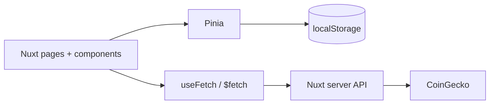

# CoinScope

**Crypto market intelligence with a production-minded Nuxt architecture.**

CoinScope is a polished portfolio application built with Nuxt 4, Vue 3, JavaScript, Pinia and Tailwind CSS. It uses CoinGecko through a server-side API boundary and demonstrates responsive UI architecture, persistent client state, resilient async states, component documentation and automated quality gates.

> Portfolio project by **Hussein Mahfouz** — Frontend Developer specializing in Vue.js / Nuxt.js.

## Live

- **Application:** https://coinscope-kappa.vercel.app/
- **Storybook:** https://coinscope-storybook.vercel.app/

## Highlights

- Global crypto market overview and trending assets
- Responsive, paginated market explorer with search and sorting
- USD / EUR / GBP preferences persisted with Pinia
- Persistent asset watchlist
- Asset detail routes with historical price charts
- Nuxt/Nitro API proxy around CoinGecko
- Upstream validation, cache headers and normalized error handling
- Explicit loading, empty, rate-limit and retry UX
- Storybook stories for reusable component states
- Unit tests, ESLint and GitHub Actions CI
- JavaScript-first codebase using Vue 3 Composition API

## Architecture



A deliberate architectural choice is that **remote API responses are not duplicated into Pinia**. Nuxt's SSR-aware data-fetching primitives own server data, while Pinia is reserved for shared application state that benefits from persistence, such as the watchlist and user preferences.

See [`docs/ARCHITECTURE.md`](docs/ARCHITECTURE.md) for the full rationale.

## Tech stack

| Area | Technology |
| --- | --- |
| Framework | Nuxt 4 / Vue 3 |
| Language | JavaScript |
| State | Pinia |
| Styling | Tailwind CSS |
| API | CoinGecko via Nitro server routes |
| Charts | Chart.js + vue-chartjs |
| Components | Storybook 10 with Vue 3 / Vite |
| Tests | Vitest |
| Quality | ESLint + GitHub Actions |

## Project structure

```text
app/
├── assets/css/          # global design tokens and Tailwind layers
├── components/
│   ├── base/            # reusable async and UI primitives
│   ├── charts/          # visualization components
│   ├── coin/            # coin-specific reusable components
│   ├── layout/          # application shell
│   ├── market/          # market feature components
│   └── watchlist/       # watchlist composition
├── composables/         # reusable application logic
├── layouts/
├── pages/               # overview, markets, watchlist, coin details
├── stores/              # Pinia application state
└── utils/               # pure formatting/sanitization helpers
server/
├── api/                 # public application API boundary
└── utils/               # CoinGecko client
stories/                 # component stories and states
tests/                   # focused unit tests
docs/                    # architecture, spec, roadmap, changelog
```

## Getting started

### Requirements

- Node.js 22+
- pnpm 10+

```bash
git clone https://github.com/mahfouzhsein/coinscope.git
cd coinscope
pnpm install
pnpm dev
```

The app is available at `http://localhost:3000`.

### Optional CoinGecko key

CoinScope can use CoinGecko's public API without a key. For a demo API key, copy the environment template:

```bash
cp .env.example .env
```

Then set:

```env
COINGECKO_API_KEY=your_demo_key
```

The key stays server-side and is never exposed to browser components.

## Storybook

Hosted Storybook: https://coinscope-storybook.vercel.app/

```bash
pnpm storybook
```

Storybook documents reusable states such as positive/negative price movement, watchlist actions, loading skeletons and provider failures.

## Quality commands

```bash
pnpm lint
pnpm test
pnpm build
pnpm build-storybook
```

The same quality gates run in GitHub Actions on pushes and pull requests.

## Data-flow decisions

### Why a Nuxt server API?

Browser components call local endpoints such as `/api/coins` rather than CoinGecko directly. This gives the application one place for parameter validation, cache policy, optional API credentials and normalized provider errors.

### Why Pinia only for local application state?

The watchlist and user preferences need to survive navigation and browser sessions. Remote market responses already have a lifecycle through Nuxt's data-fetching layer, so copying them into a store would add synchronization complexity without a clear benefit.

## Resilience

CoinScope intentionally demonstrates non-happy paths:

- skeleton loading states
- empty search results
- upstream provider failures
- CoinGecko rate limiting
- retry actions
- invalid asset identifiers
- application-level error page

## Roadmap

The current portfolio scope and future enhancements are tracked in [`docs/ROADMAP.md`](docs/ROADMAP.md).

## License

MIT — see [`LICENSE`](LICENSE).
