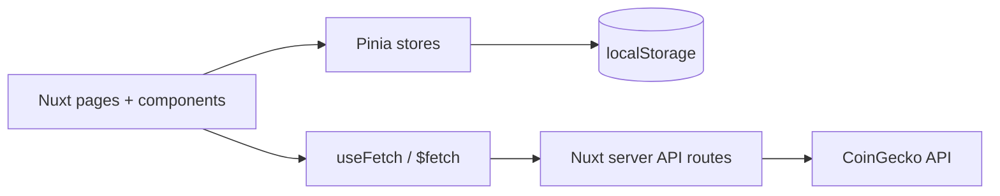

# Architecture

CoinScope separates remote server state from persistent application state.

## Remote data

CoinGecko responses are fetched through Nitro server routes under `server/api`. Components never call CoinGecko directly. This centralizes validation, cache headers, optional API-key handling and normalized upstream errors.

## Application state

Pinia is intentionally reserved for state that is shared across routes or persisted locally: watchlist membership and user preferences. API responses are not duplicated into Pinia because Nuxt already provides SSR-aware data fetching and caching primitives.

## Component design

- `base/`: reusable presentation primitives and states.
- `coin/`: coin-specific reusable components.
- `market/`: dashboard and market-list composition.
- `charts/`: isolated visualization concerns.
- `layout/`: application shell.

Components are extracted when they represent a reusable UI concept, own behavior, or reduce meaningful complexity; trivial markup is kept local to avoid artificial abstraction.

## Resilience

The UI deliberately models pending, empty, provider-error and retry states. Server routes normalize CoinGecko failures and distinguish rate limiting from general upstream outages.
